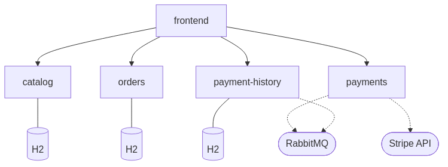

# CloudCart

A microservices-based e-commerce demo application built with Spring Boot.

CloudCart demonstrates common microservice architecture patterns including RESTful communication, database-per-service design, and loose coupling through messaging. It consists of five services: a product catalog, order management, payment processing via Stripe, payment history tracking via RabbitMQ, and a web frontend.



## Table of Contents

- [Background](#background)
- [Install](#install)
- [Usage](#usage)
- [API](#api)
- [Contributing](#contributing)
- [License](#license)

## Background

CloudCart was built to demonstrate microservice constructs such as:

- Independent Spring Boot services with separate concerns
- RESTful clients and servers
- Database-per-microservice design (H2 embedded databases)
- Loose coupling through RabbitMQ messaging
- Payment processing with the Stripe API

### Architecture

The application is composed of five microservices managed as a Maven multi-module project with a root parent POM:

| Service | Description |
|---|---|
| [catalog](catalog) | Product catalog with 50 seeded items, backed by H2 |
| [orders](orders) | Order management, backed by H2 |
| [payments](payments) | Payment processing via the Stripe API, publishes to RabbitMQ |
| [payment-history](payment-history) | Consumes payment messages from RabbitMQ, stores in H2 |
| [frontend](frontend) | Web UI and REST API gateway using Thymeleaf and RestClient |

A [Locust-based load generator](loadgenerator) is also included for testing telemetry and scaling.

## Install

### Prerequisites

- Java 21+
- A [Stripe](https://dashboard.stripe.com/register) developer account (free) for payment processing
- RabbitMQ (required by the `payments` and `payment-history` services)
- Docker and Docker Compose (optional, for containerized deployment)
- A Kubernetes cluster (optional, for Kubernetes deployment)

### Clone

```bash
git clone https://github.com/<owner>/cloud-cart.git
cd cloud-cart
```

### Build

Build all services from the root using the included Maven Wrapper:

```bash
./mvnw clean package -DskipTests
```

Build a single service:

```bash
./mvnw clean package -pl catalog -DskipTests
```

### Makefile

A Makefile is provided for common tasks:

```bash
make help       # List all available targets
make build      # Build all services (skip tests)
make test       # Run all tests
make clean      # Clean all build artifacts
```

Per-service targets are also available (`build-<service>`, `test-<service>`):

```bash
make build-catalog
make test-payments
```

## Usage

### Docker Compose

The simplest way to run all services locally. Set your Stripe API key and start the stack:

```bash
STRIPE_API_KEY=<your-key> docker compose up
```

The frontend is accessible at `http://localhost:8080`.

To also start the load generator:

```bash
STRIPE_API_KEY=<your-key> docker compose --profile loadgen up
```

To rebuild containers after code changes:

```bash
STRIPE_API_KEY=<your-key> docker compose up --build -d
```

Or using the Makefile:

```bash
make docker-up      # Start all services
make docker-down    # Stop all services
make docker-logs    # Follow logs
```

### Kubernetes

Create the namespace and Stripe secret, then apply the manifest:

```bash
kubectl create ns cloud-cart
kubectl create secret generic -n cloud-cart stripe-secret --from-literal=stripe-api-key=<your-key>
kubectl apply -n cloud-cart -f ./manifests/cloud-cart.yaml
```

### Local / Standalone

Run each service individually with Maven:

1. Install and start a RabbitMQ instance. Set the `RABBITMQ_HOST` environment variable to its hostname for the `payments` and `payment-history` services.
2. Set the `STRIPE_API_KEY` environment variable for the `payments` service.
3. Start each service:

```bash
./mvnw -pl <service> spring-boot:run -Dspring-boot.run.profiles=local
```

### Testing Payments

Use these Stripe test card numbers with any 3-digit CVC and any future expiration date:

| Number | Brand |
|---|---|
| 4242424242424242 | Visa |
| 5555555555554444 | Mastercard |
| 378282246310005 | American Express |
| 6011111111111117 | Discover |

See the [Stripe testing documentation](https://stripe.com/docs/testing) for additional test cards.

## API

The frontend service exposes REST endpoints under `/api`:

| Method | Endpoint | Description |
|---|---|---|
| `GET` | `/api/catalog` | List all catalog items |
| `GET` | `/api/catalog/{id}` | Get a catalog item by ID |
| `POST` | `/api/order` | Place an order |
| `GET` | `/api/payments` | List all payments |
| `GET` | `/api/payments/{id}` | Get a payment by ID |
| `GET` | `/api/version` | Get the application version |

Full API documentation is available on [Postman](https://documenter.getpostman.com/view/1749839/UVyxQtit).

## TODO

- **Add integration/contract tests** — The current test suite covers unit-level behavior with mocked HTTP calls. Consider adding integration tests (e.g. Testcontainers, Spring Cloud Contract) to verify actual inter-service communication contracts.

## Contributing

PRs are accepted. For questions or bug reports, please open an issue on GitHub.

## License

[Apache-2.0](LICENSE) &copy; Brian Jimerson
