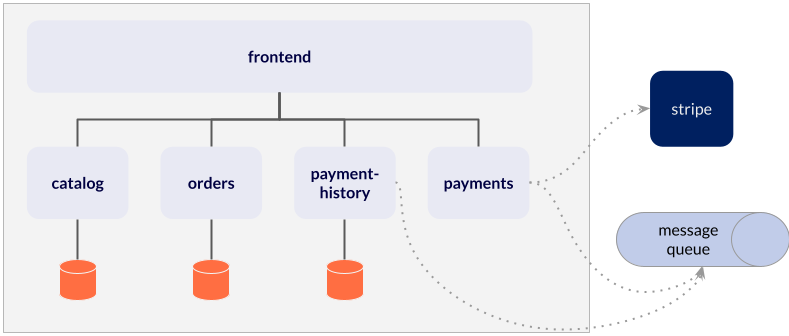

# CloudCart E-commerce Demo Application

This is an example application to demonstrate Microservice constructs, such as:

- Microservices with Spring Boot
- RESTful clients and servers
- Database per microservice design
- Loose coupling through messaging



## Databases
There are microservices that use a database:
- [catalog](catalog)
- [orders](orders)
- [payment-history](payment-history)

By default these microservices use an embedded H2 database in each microservice.

## How to run the projects

### Kubernetes

The orders project uses the Stripe API to process credit cards. You will need to create a free developer account at the [Stripe Developer Dashboard](https://dashboard.stripe.com/register). Once you have your Stripe API key, create a secret in your cluster called `stripe-secret`:

```bash
kubectl create ns cloud-cart
kubectl create secret generic -n cloud-cart stripe-secret --from-literal=strip-api-key=<my-key>
```

You can then use the [manifest](./manifests/cloud-cart.yaml) to install the application:

```bash
kubectl apply -n cloud-cart -f ./manifests/cloud-cart.yaml
```

### Local / VM

If you don't have a local Kubernetes cluster like kind or minikube, you can run the applications standalone on your local workstation or a virtual machine. Here are the basic steps:

- Install an instance of RabbitMQ, and set an environment variable called `RABBITMQ_HOST` to something to the host name of the RabbitMQ server. This environment variable should be in the context of both the [`payments`](payments) project and the [`payment-history`](payment-history) project.
- Create a free developer account at the [Stripe Developer Dashboard](https://dashboard.stripe.com/register). Add an environment variable called `STRIPE_API_KEY` with your Stripe API key for the [`payments`](payments) project. The environment variable should be plain text, not encoded.
- Start each project with Maven and a local Spring profile: `mvn clean package spring-boot:run -Dspring-boot.run.profiles=local`.

## Load generator

There is a load generator using Locust that is deployed along side the application. You can use this display things like telemetry and scaling.

## Testing

You can use the frontend project to test placing an order. For successful charges, you can use these test credit cards. Using other card numbers, an invalid month (e.g. 13), a year in the past, or a two digit cvc will cause a failure.

| NUMBER           | BRAND                       | CVC          | DATE            |
|------------------|-----------------------------|--------------|-----------------|
| 4242424242424242 | Visa                        | Any 3 digits | Any future date |
| 4000056655665556 | Visa (debit)                | Any 3 digits | Any future date |
| 5555555555554444 | Mastercard                  | Any 3 digits | Any future date |
| 2223003122003222 | Mastercard (2-series)       | Any 3 digits | Any future date |
| 5200828282828210 | Mastercard (debit)          | Any 3 digits | Any future date |
| 5105105105105100 | Mastercard (prepaid)        | Any 3 digits | Any future date |
| 378282246310005  | American Express            | Any 4 digits | Any future date |
| 371449635398431  | American Express            | Any 4 digits | Any future date |
| 6011111111111117 | Discover                    | Any 3 digits | Any future date |
| 6011000990139424 | Discover                    | Any 3 digits | Any future date |
| 3056930009020004 | Diners Club                 | Any 3 digits | Any future date |
| 36227206271667   | Diners Club (14 digit card) | Any 3 digits | Any future date |
| 3566002020360505 | JCB                         | Any 3 digits | Any future date |
| 6200000000000005 | UnionPay                    | Any 3 digits | Any future date |

## API
The [frontend](frontend) application exposes a number of API endpoints for automation\.The API documentation can be viewed [here](https://documenter.getpostman.com/view/1749839/UVyxQtit).