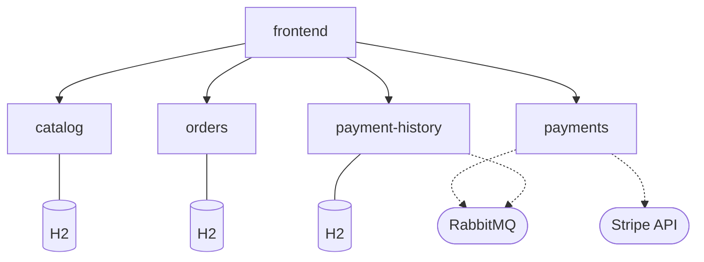

```mermaid
graph TD
    frontend["frontend"]

    catalog["catalog"]
    orders["orders"]
    payment-history["payment-history"]
    payments["payments"]

    catalog_db[("H2")]
    orders_db[("H2")]
    payment_history_db[("H2")]

    stripe(["Stripe API"])
    rabbitmq(["RabbitMQ"])

    frontend --> catalog
    frontend --> orders
    frontend --> payment-history
    frontend --> payments

    catalog --- catalog_db
    orders --- orders_db
    payment-history --- payment_history_db

    payments -.-> stripe
    payments -.-> rabbitmq
    payment-history -.-> rabbitmq
```
