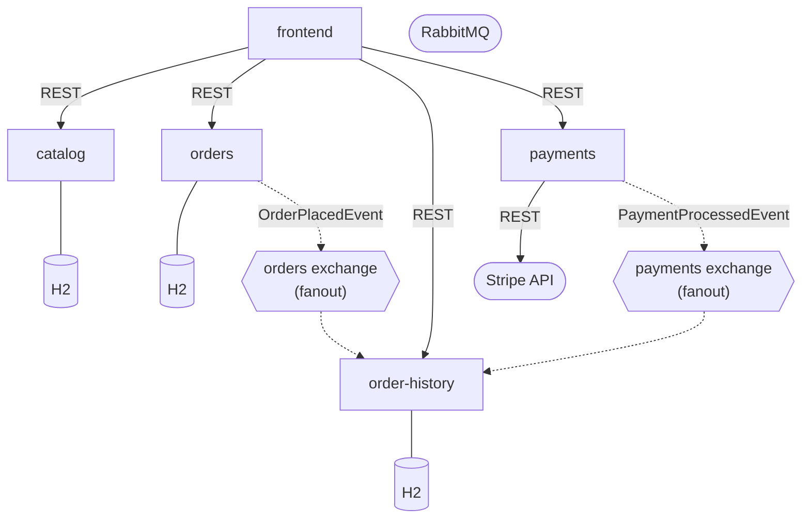

## Patterns

- **Database-per-service** -- Each service owns its own H2 database. No shared state between services.
- **Event choreography** -- Orders and payments each publish domain events to their own RabbitMQ fanout exchange. The order-history service subscribes to both and correlates events by a shared correlation ID. No service orchestrates or directs the others, keeping them loosely coupled.
- **Loose coupling** -- Services communicate only through REST APIs (synchronous) and pub/sub events (asynchronous). Adding a new event consumer requires no changes to the publishers.
- **Correlation IDs** -- The frontend generates a UUID and passes it to both the orders and payments services. This ID links events from different services without requiring direct coupling between them.
